# 📊 Portfolio de Dados — End-to-End Pipeline na GCP

Pipeline de dados completo rodando na GCP com orquestração, transformação, modelagem e visualização — usando ferramentas reais de mercado.

> 🔗 [Ver dashboard ao vivo](https://datastudio.google.com/reporting/4bb981cb-9bef-4c27-aa22-1dca3d11bc7b)

---

## 🏗️ Arquitetura

```
API Pública (BACEN + IBGE SIDRA)
        ↓
Apache Airflow (orquestração)
  ├── BacenHook → BacenOperator → 7 indicadores econômicos
  └── IbgeHook  → IbgeOperator  → 6 indicadores macroeconômicos
        ↓
BigQuery — Medallion Architecture
  ├── Bronze → dados brutos (Airflow)
  ├── Silver → dados limpos (dbt)
  └── Gold   → dados analíticos (dbt) — Star Schema
        ↓
Looker Studio (dashboard com 4 páginas — 12 meses de histórico)

CI/CD: GitHub → Jenkins → validação → deploy automático
```

---

## 🛠️ Stack

| Camada | Tecnologia |
|---|---|
| Orquestração | Apache Airflow 3.2 (LocalExecutor) |
| Hooks & Operators | Python customizado |
| Data Warehouse | BigQuery (GCP) |
| Transformação | dbt Core 1.11 |
| CI/CD | Jenkins LTS |
| Infraestrutura | Docker + GCP (VM e2-medium) |
| Versionamento | GitHub + Webhook |
| Visualização | Looker Studio |

---

## 📸 Screenshots

> 💡 Clique no título para abrir • Clique na imagem para ampliar

<details>
<summary><b>Dashboard — Looker Studio</b></summary>
<br>
<table>
  <tr>
    <th align="center">Visão Geral</th>
    <th align="center">Inflação Detalhada</th>
  </tr>
  <tr>
    <td align="center"><a href="imagens/painel_1.png">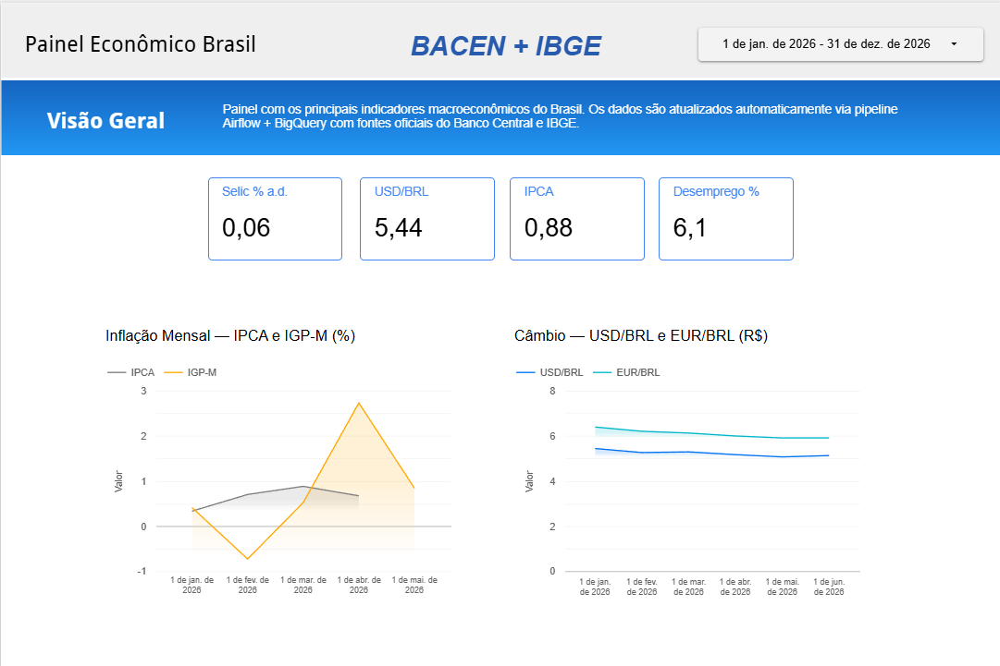</a></td>
    <td align="center"><a href="imagens/painel_2.png">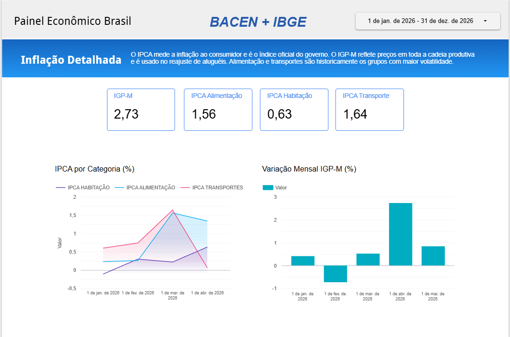</a></td>
  </tr>
  <tr>
    <th align="center">Mercado de Trabalho</th>
    <th align="center">Atividade Econômica</th>
  </tr>
  <tr>
    <td align="center"><a href="imagens/painel_3.png">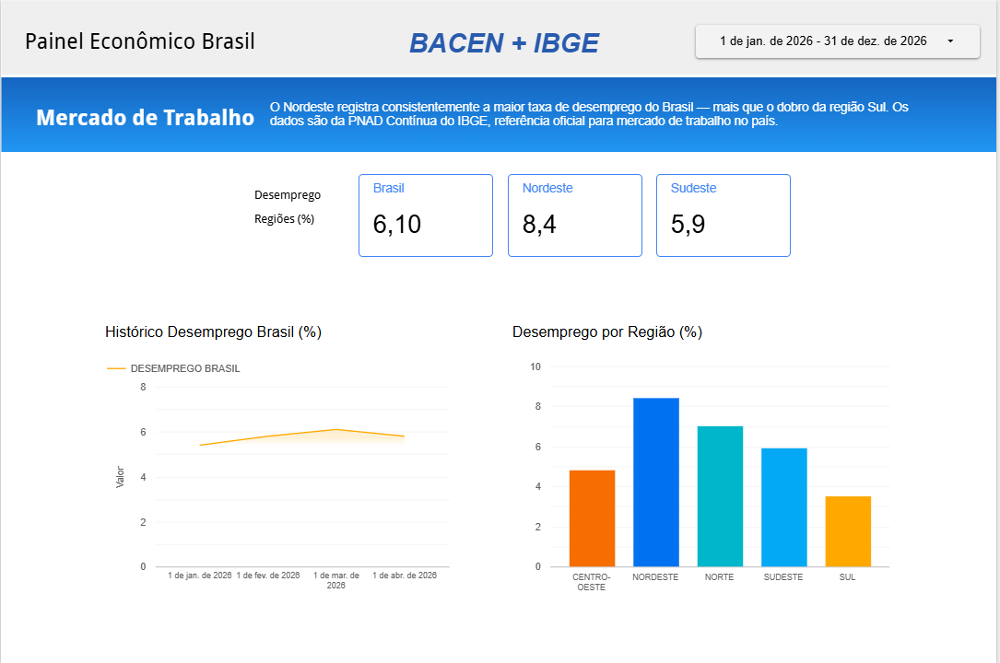</a></td>
    <td align="center"><a href="imagens/painel_4.png">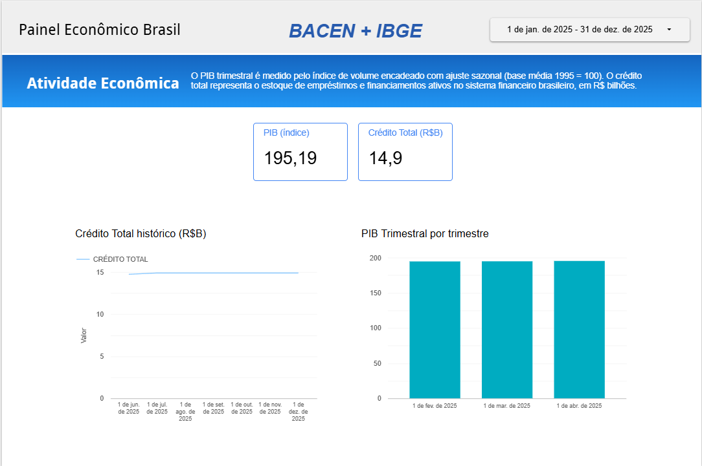</a></td>
  </tr>
</table>
</details>

<details>
<summary><b>BigQuery — Camada Bronze</b></summary>
<br>

| bacen | ibge |
|---|---|
| [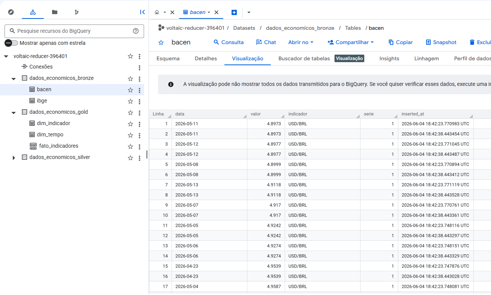](imagens/bronze_bacen.png) | [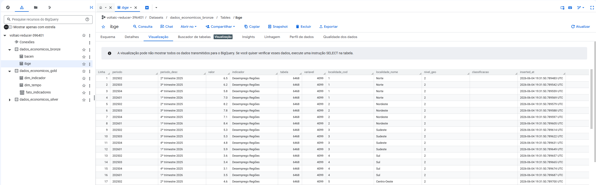](imagens/bronze_ibge.png) |

</details>

<details>
<summary><b>BigQuery — Camada Gold</b></summary>
<br>

| dim_indicador | dim_tempo |
|---|---|
| [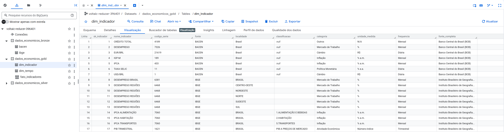](imagens/ind_gold.png) | [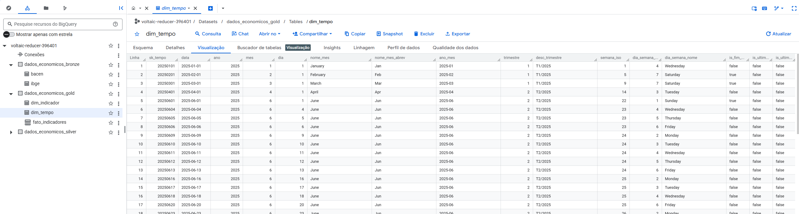](imagens/tempo_gold.png) |

| **fato_indicadores** |
|:---:|
| [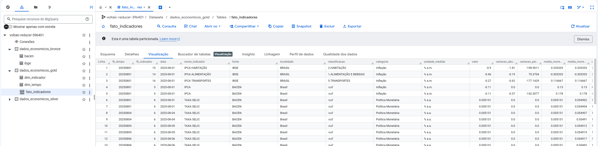](imagens/fato_gold.png) |

</details>

<details>
<summary><b>dbt — 38 Testes Passando</b></summary>
<br>
<p align="center">
  <a href="imagens/dbt_tests.png">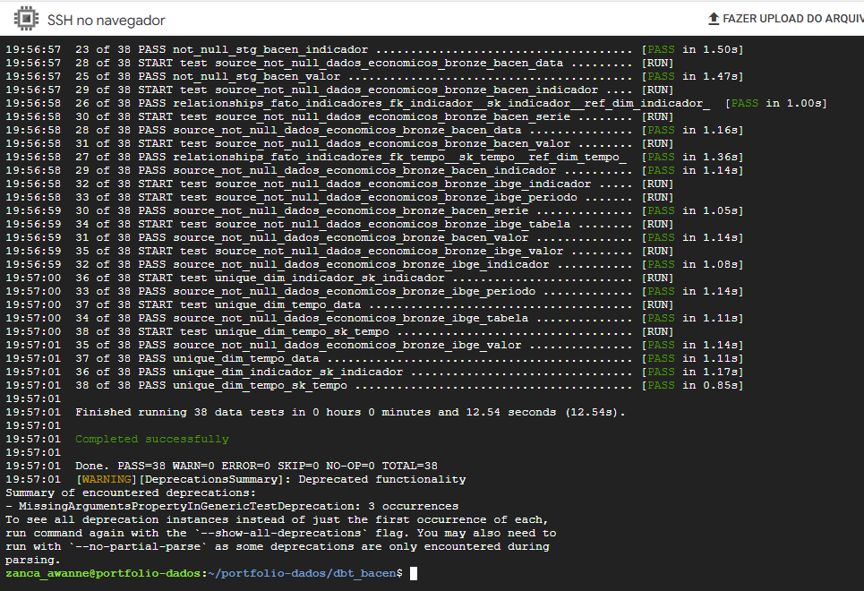</a>
</p>
</details>

<details>
<summary><b>CI/CD — Jenkins Builds</b></summary>
<br>
<p align="center">
  <a href="imagens/jenkins_builds.png">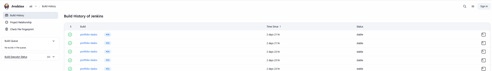</a>
</p>
</details>

---

## 📂 Estrutura do Projeto

```
pipeline-dados-GCP-Bacen/
  ├── dags/               → DAGs do Airflow
  ├── hooks/              → BacenHook e IbgeHook — conexão com APIs
  ├── operators/          → BacenOperator e IbgeOperator — tasks customizadas
  ├── dbt_bacen/          → Projeto dbt
  │   ├── macros/         → generate_schema_name (Medallion)
  │   ├── models/
  │   │   ├── silver/     → stg_bacen, stg_ibge (padronização)
  │   │   └── gold/       → dim_tempo, dim_indicador, fato_indicadores
  │   └── dbt_project.yml
  ├── imagens/            → Screenshots do projeto
  ├── Jenkinsfile         → Pipeline CI/CD
  └── docker-compose.yaml → Infraestrutura local (LocalExecutor)
```

---

## 🚀 DAGs

### painel_economico_bacen
Busca os principais indicadores econômicos do Brasil via API do Banco Central e salva no BigQuery (camada Bronze).

- **Agendamento:** Diário (`@daily`)
- **Modos:** `incremental` (último registro) ou `historico` (12 meses)

| Task | Indicador | Série BACEN |
|---|---|---|
| busca_selic | Taxa Selic | 11 |
| busca_ipca | IPCA | 433 |
| busca_igpm | IGP-M | 189 |
| busca_dolar | USD/BRL | 1 |
| busca_euro | EUR/BRL | 21619 |
| busca_desemprego | Desemprego | 7326 |
| busca_credito | Crédito Total | 4189 |

---

### painel_economico_ibge
Busca indicadores macroeconômicos via API SIDRA do IBGE e salva no BigQuery (camada Bronze).

- **Agendamento:** Semanal (`@weekly`)
- **Modos:** `incremental` (último período) ou `historico` (12 meses)

| Task | Indicador | Tabela SIDRA | Variável |
|---|---|---|---|
| busca_pib_trimestral | PIB Trimestral | 1621 | 584 |
| busca_ipca_alimentacao | IPCA Alimentação | 7060 | 63 |
| busca_ipca_habitacao | IPCA Habitação | 7060 | 63 |
| busca_ipca_transportes | IPCA Transportes | 7060 | 63 |
| busca_desemprego_brasil | Desemprego Brasil | 6381 | 4099 |
| busca_desemprego_regioes | Desemprego Regiões | 6468 | 4099 |

---

### dbt_pipeline
Roda os modelos dbt após o BACEN — popula Silver e Gold.

---

## 🔌 Hooks & Operators Customizados

**BacenHook** — conexão com a API de Séries Temporais do BACEN:
```python
# Modo incremental
hook = BacenHook(serie=11, registros=1)

# Modo histórico
hook = BacenHook(serie=11, data_inicio="01/06/2025")

dados = hook.get_dados()
# → [{"data": "01/06/2026", "valor": "0.0534"}]
```

**IbgeHook** — conexão com a API SIDRA do IBGE:
```python
hook = IbgeHook(
    tabela=7060,
    variavel=63,
    nome_indicador="IPCA Alimentação",
    classificacao_cod="315",
    classificacao_cat="7170",
    nivel_geo="1",
    localidade="all",
    periodo="last1"
)
dados = hook.get_dados()
```

---

## 🧱 Medallion Architecture com dbt

```
Bronze → dados_economicos_bronze
  ├── bacen  → 7 indicadores BACEN (diário)
  └── ibge   → 6 indicadores IBGE SIDRA (semanal)

Silver → dados_economicos_silver
  ├── stg_bacen  → padronização de datas e nomes (VIEW)
  └── stg_ibge   → conversão de período IBGE → DATE (VIEW)

Gold → dados_economicos_gold
  ├── dim_tempo          → dimensão calendário diária (TABLE)
  ├── dim_indicador      → metadados dos indicadores (TABLE)
  └── fato_indicadores   → tabela fato — Star Schema (TABLE)
                            particionada por mês
                            clusterizada por fonte/categoria/indicador
```

**38 testes de qualidade:**
- `not_null` e `unique` nas surrogate keys
- `accepted_values` em fonte e indicadores
- `relationships` — integridade referencial FK → PK entre fato e dimensões

---

## ⭐ Star Schema

```
        dim_tempo
            |
            | fk_tempo
            |
dim_indicador — fk_indicador — fato_indicadores
```

A `fato_indicadores` contém por linha: `valor`, `variacao_absoluta`, `variacao_percentual`, `media_movel_30d` e `media_movel_90d`.

Une dados do BACEN e IBGE em uma única tabela analítica com 17 indicadores e cobertura geográfica de 5 regiões do Brasil.

---

## ⚙️ CI/CD com Jenkins

Todo push no GitHub dispara automaticamente o Jenkins via **webhook**:

```
git push
    ↓
GitHub notifica Jenkins (webhook)
    ↓
Jenkins valida:
  ✅ Sintaxe das DAGs
  ✅ Sintaxe dos Hooks
  ✅ Sintaxe dos Operators
    ↓
Deploy automático pro Airflow
```

---

## 📊 Dashboard — Looker Studio

4 páginas cobrindo os principais temas econômicos do Brasil:

| Página | Conteúdo |
|---|---|
| Visão Geral | Selic, Câmbio, IPCA, Desemprego — scorecards + gráficos |
| Inflação Detalhada | IPCA por categoria (Alimentação, Habitação, Transportes) + IGP-M |
| Mercado de Trabalho | Desemprego Brasil histórico + comparativo por região |
| Atividade Econômica | PIB Trimestral + Crédito Total |

---

## 🔧 Infraestrutura

- **Cloud:** Google Cloud Platform (GCP)
- **VM:** e2-medium (2 vCPU, 4GB RAM + 4GB Swap)
- **SO:** Ubuntu 22.04 LTS
- **Executor:** LocalExecutor (sem Redis/Celery)
- **Containers:** Docker + Docker Compose
- **IP:** Estático (não muda ao reiniciar)

---

## 👩‍💻 Autora

**Awanne Beatriz Zanca**

Analista de Dados com foco em Analytics Engineering — 4+ anos de experiência em Stone, Raízen, Bosch e IBM.

- LinkedIn: [awanne-zanca](https://linkedin.com/in/awanne-zanca)
- GitHub: [AwanneZanca](https://github.com/AwanneZanca)
